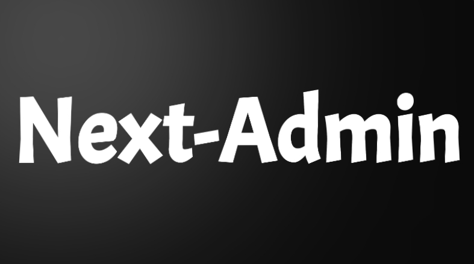
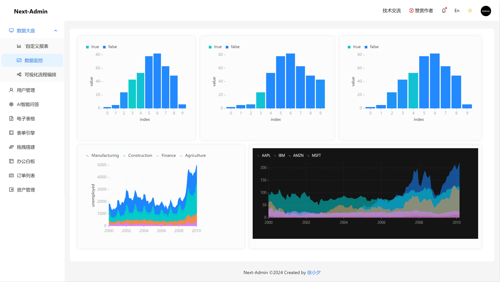

Language : 🇺🇸 | [🇨🇳](./README.zh-CN.md) 

<p align="center">
  <a href="https://nextjs.org">
    <picture>
      <source media="(prefers-color-scheme: dark)" srcset="./tt.png">
      
    </picture>
    <h1 align="center">Next-Admin</h1>
  </a>
</p>

<div align="center">

An out-of-box UI solution for enterprise applications as a React boilerplate.




</div>

- Preview: http://next-admin.com
- Login Page: http://next-admin.com/user/login
- china mirror: https://gitee.com/lowcode-china/next-admin
- Nocode/WEP: http://wep.turntip.cn

## 1.0 is out! 🎉🎉🎉

Next-Admin 1.2.0

## Features

- Next14.0 + antd5.0
- Support i18n
- Theme switching is supported
- Integrate data visualization reports
- Support drag and drop page
- Out-of-the-box business pages
- Custom drag-and-drop reports are supported
- Next Full-stack best practices
- Support mobile PC adaptation
- Support JWT demo
- Support AI conversations
- Support Choreography
- Support Excel
- Support Chart Editor

## Usage

### Install

```shell
$ git clone git@github.com:MrXujiang/next-admin.git
```

Install dependencies:

```shell
$ cd next-admin && pnpm install
```

run：
```shell
# yarn dev
$ pnpm dev
```

## Browsers support

Modern browsers.

| [](http://godban.github.io/browsers-support-badges/)</br>Edge | [](http://godban.github.io/browsers-support-badges/)</br>Firefox | [](http://godban.github.io/browsers-support-badges/)</br>Chrome | [](http://godban.github.io/browsers-support-badges/)</br>Safari | [](http://godban.github.io/browsers-support-badges/)</br>Opera |
| --- | --- | --- | --- | --- |
| Edge | last 2 versions | last 2 versions | last 2 versions | last 2 versions |

## More Production

| name                                                                              | Description                                                                             |
| --------------------------------------------------------------------------------- | --------------------------------------------------------------------------------------- |
| [H5-Dooring](https://github.com/MrXujiang/h5-Dooring)                             | 让 H5 制作像搭积木一样简单, 轻松搭建 H5 页面, H5 网站, PC 端网站, LowCode 平台.         |
| [V6.Dooring](https://github.com/MrXujiang/v6.dooring.public)                      | 可视化大屏解决方案, 提供一套可视化编辑引擎, 助力个人或企业轻松定制自己的可视化大屏应用. |
| [dooring-electron-lowcode](https://github.com/MrXujiang/dooring-electron-lowcode) | 基于 electron 的 H5-Dooring 编辑器桌面端.                                               |
| [DooringX](https://github.com/H5-Dooring/dooringx)                                | 快速高效搭建可视化拖拽平台.                                                             |
| [Mitu](https://github.com/H5-Dooring/mitu-editor)                                 | 一款轻量级且可扩展的图片/图形编辑器解决方案.                                            |
| [xijs](https://github.com/MrXujiang/xijs) | 一个开箱即用的面向业务的javascript工具库 |

## Contributing

Any type of contribution is welcome, here are some examples of how you may contribute to this project:

- Use Ant Design Pro in your daily work.
- Submit [issues](https://github.com/MrXujiang/next-admin/issues) to report bugs or ask questions.
- Propose [pull requests](https://github.com/MrXujiang/next-admin/pulls) to improve our code.

## Concat

wechat: `cxzk_168`
