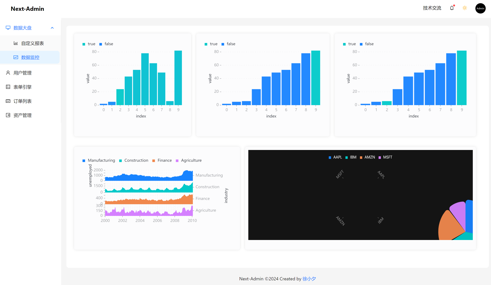

Language : [🇺🇸](./README.md)  | 🇨🇳

<p align="center">
  <a href="https://nextjs.org">
    <picture>
      <source media="(prefers-color-scheme: dark)" srcset="./tt.png">
      
    </picture>
    <h1 align="center">Next-Admin</h1>
  </a>
</p>

<div align="center">

一款基于Nextjs最新版本 + antd5.0 的开箱即用的中后台管理系统.


</div>

- 预览: http://next-admin.com
- 登录页面: http://next-admin.com/user/login
- 国内镜像: https://gitee.com/lowcode-china/next-admin

## 1.0 版本! 🎉🎉🎉

Next-Admin 1.0.0

## 特点

- Next14.0 + antd5.0
- 支持国际化
- 支持主题切换
- 内置数据可视化报表
- 开箱即用的业务页面模板
- 支持自定义拖拽看板
- 集成办公白板
- Next全栈最佳实践
- 支持移动端和PC端自适应

## 使用

### 安装

```shell
$ git clone git@github.com:MrXujiang/next-admin.git
```

安装依赖:

```shell
$ cd next-admin && pnpm install
```

## 浏览器支持

现代浏览器.

| [](http://godban.github.io/browsers-support-badges/)</br>Edge | [](http://godban.github.io/browsers-support-badges/)</br>Firefox | [](http://godban.github.io/browsers-support-badges/)</br>Chrome | [](http://godban.github.io/browsers-support-badges/)</br>Safari | [](http://godban.github.io/browsers-support-badges/)</br>Opera |
| --- | --- | --- | --- | --- |
| Edge | last 2 versions | last 2 versions | last 2 versions | last 2 versions |

## 贡献

欢迎对next感兴趣的朋友一起共建:

- 提交 [issues](https://github.com/MrXujiang/next-admin/issues) 来报告问题和优化建议.
- 主动 [pull requests](https://github.com/MrXujiang/next-admin/pulls) 来优化代码.

## 联系

微信: `cxzk_168`
